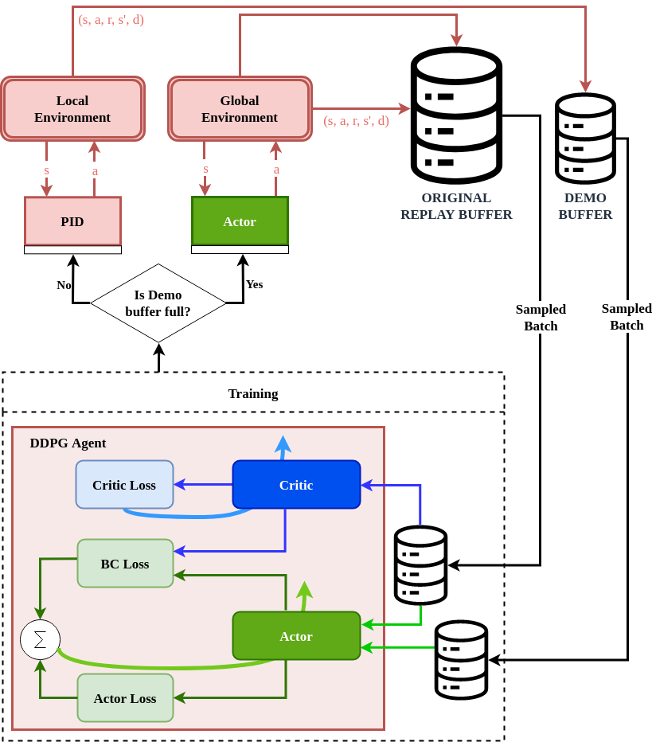
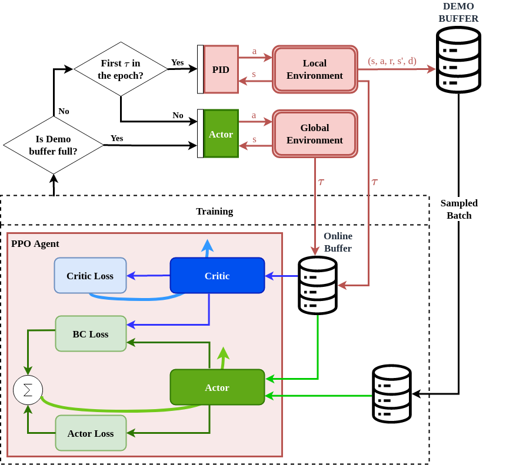

# Demo-EASE: Demonstration-Guided Reinforcement Learning for Kinova Gen3

This repository implements **Demo-EASE**, which improves the sample efficiency of reinforcement learning for robotic manipulation by exploiting natural symmetries in the environment and integrating expert demonstrations through a combination of behavior cloning and reinforcement learning. The method is validated on point-to-point reach task with and without obstacles and pick-and-place, showing better learning performance compared to traditional RL.

The experiments are based on:
📄 [Demo-EASE Paper](https://arxiv.org/pdf/2304.06055)

---

## 🧪 Sub-Projects

Each task has its own folder and can be run independently by executing `main.py`.

- `DemoEASE_P2P/`  
  ➤ **Point-to-Point (P2P)** reaching task using **DDPG + Demo-EASE**

- `DemoEASE_P2PO/`  
  ➤ **Point-to-Point with Obstacle**, also using **DDPG + Demo-EASE**

- `DemoEASE_PickPlace/`  
  ➤ **Pick-and-Place** task using **PPO + Demo-EASE**

<p align="center">
  
  &nbsp;&nbsp;&nbsp;&nbsp;
  
</p>

<p align="center">
  <em>Left: DDPG + Demo-EASE architecture &nbsp;&nbsp;&nbsp;&nbsp; Right: PPO + Demo-EASE architecture</em>
</p>

Each environment has its own version of the robot simulation (`kinova_sim/`).

---

## 🚀 Getting Started

1. **Clone the repository**:
```bash
git clone https://github.com/amsoufi/DemoEASE.git
cd DemoEASE
```

2. **Install dependencies**:
```bash
pip install -r requirements.txt
```

3. **Run a training experiment**:
```bash
cd DemoEASE_P2P     # or DemoEASE_P2PO or DemoEASE_PnP
python main.py
```

---

## 🛠 Notes

- This codebase was built with heavy reference to [OpenAI Spinning Up](https://spinningup.openai.com/en/latest/).
- Each sub-project can be run independently by executing `main.py`.
- Saved logs and models will be created in the `data/` folder of each sub-project.
- **Automated Experiment Script:**  
  An example bash script (`myscript.sh`) is provided that automates running `run.py` with different hyperparameter settings.  
  In the example, the hyperparameter being swept is the **behavior cloning (BC) weight**, but you can easily substitute it with any other desired hyperparameter (e.g., learning rate, discount factor).  
  Each trained model is saved with a **timestamp** and **repeat number** to organize the results automatically.

---

## 📄 License

This project is licensed under the MIT License. See the [LICENSE](LICENSE) file for details.

---

## 📚 Citation

Please cite the following if you use this work in your research:

> A. M. S. Enayati et al., “Exploiting Symmetry and Heuristic Demonstrations in Off-policy Reinforcement Learning for Robotic Manipulation”, arXiv:2304.06055, 2023.

---
